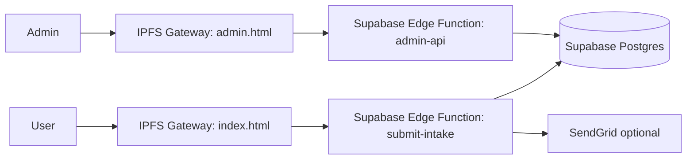

# IMPERIA (Y3KDigital) — Genesis Intake Command Center


Compliance posture: non-binding intake, observation-first, no promises.

This repo contains the Genesis Allocation Registration system for K IMPERIA.

---

## Table of Contents

- [What This Is](#what-this-is)
- [What This Is Not](#what-this-is-not)
- [Architecture](#architecture)
- [Quick Start (Local)](#quick-start-local)
- [Repo Navigation](#repo-navigation)
- [Deployment (Public Links)](#deployment-public-links)
- [GitHub Pages (Demo)](#github-pages-demo)
- [License](#license)
- [Documentation](#documentation)

---

## What This Is

This is **not** a token sale page.

This is the **front gate** to the K IMPERIA issuance and settlement layer — a system for:

- Collecting non-binding allocation intent by **physical metal weight**
- Building a compliant demand ledger for responsible issuance
- Establishing a structured back-office intake pipeline
- Creating an auditable trail for future XRPL settlement

---

## What This Is Not

- Not an investment offer
- Not a purchase agreement
- Not a guarantee of eligibility, allocation, acceptance, or issuance

## Architecture



## Purpose

K IMPERIA is a reserve-style issuance layer that references **verified physical metal weight** — not price, yield, or market value.

Genesis registration allows UNYKORN to:

- Measure real allocation demand by weight
- Structure issuance responsibly
- Prioritize early participants
- Form compliant issuance cohorts

**Registration is non-binding.**

---

## Project Structure

```
k-imperia-genesis-intake/
|
|-- index.html               # Public intake UI (IPFS)
|-- styles.css               # Styling
|-- k-imperia.js             # Intake logic + referrals
|
|-- admin.html               # Admin UI (IPFS)
|-- admin.css
|-- admin.js                 # Calls protected admin Edge Function
|
|-- supabase-schema.sql      # Postgres schema, views, RPC, triggers
|-- supabase/functions/      # Edge Functions (submit-intake, admin-api)
|
|-- deploy-ipfs-desktop.ps1  # IPFS Desktop publisher (no ipfs.exe required)
|-- server.js                # Local-only dev/reference server
|-- docs/                    # Diagrams and operational docs
```

---

## Repo Navigation

- Start here: [docs/README.md](docs/README.md)
- System overview: [docs/ARCHITECTURE.md](docs/ARCHITECTURE.md)
- Flows + diagrams: [docs/FLOWS.md](docs/FLOWS.md)
- Production deployment runbook: [docs/DEPLOYMENT.md](docs/DEPLOYMENT.md)
- Ops / admin endpoints / queries: [docs/OPERATIONS.md](docs/OPERATIONS.md)
- Threat model + controls: [docs/SECURITY.md](docs/SECURITY.md)

- Public UI entrypoints: `index.html`, `k-imperia.js`
- Admin UI entrypoints: `admin.html`, `admin.js`
- Database schema: `supabase-schema.sql`
- Edge Functions: `supabase/functions/submit-intake/`, `supabase/functions/admin-api/`

## Quick Start (Local)

### 1. Install Dependencies

```bash
npm install
```

### 2. Configure Environment

```bash
cp .env.example .env
```

Edit `.env` and add your SendGrid API key and email addresses.

### 3. Run Local Server (optional)

```bash
npm start
```

Server runs at: `http://localhost:3000`

### 4. Test Locally

Open `http://localhost:3000` in your browser.

---

## 📧 Email Setup (SendGrid)

### Get SendGrid API Key

1. Sign up at: https://sendgrid.com
2. Create API key: Settings → API Keys → Create API Key
3. Select "Full Access" permissions
4. Copy key to `.env` file

### Configure Recipients

In `.env`, set your team email addresses:

```env
INTERNAL_RECIPIENTS=kevan@unykorn.io,jimmy@unykorn.io,thomas@unykorn.io,isaac@unykorn.io
```

### Verify Domain (Production)

For production deployments, verify your sending domain in SendGrid to avoid spam filters.

---

## Deployment (Public Links)

Public deployment is:

- Frontend/Admin published to IPFS
- API served by Supabase Edge Functions

See [docs/DEPLOYMENT.md](docs/DEPLOYMENT.md) for the end-to-end steps.

### IPFS publish (IPFS Desktop)

Set your Supabase functions base URL:

```powershell
$env:SUPABASE_FUNCTIONS_BASE="https://<PROJECT_REF>.supabase.co/functions/v1"
.\deploy-ipfs-desktop.ps1
```

The script prints the public links.

---

## GitHub Pages (Demo)

GitHub Pages is useful to **show the UI** publicly. It is a static host (no server), so:

- Without `window.K_IMPERIA_FUNCTIONS_BASE` configured, submissions/admin API calls are disabled on `github.io`.
- For a fully working public flow, prefer the IPFS + Supabase Edge Functions deployment.

### Enable Pages

1. GitHub repo → **Settings** → **Pages**
2. **Build and deployment** → Source: **Deploy from a branch**
3. Branch: `main` and folder: `/ (root)`

Your site will appear at:

- `https://y3kdigital.github.io/imperia/`

### Point Pages at Supabase (optional)

Edit `index.html` and `admin.html` and set:

- `window.K_IMPERIA_FUNCTIONS_BASE = 'https://<PROJECT_REF>.supabase.co/functions/v1'`

---

## License

- Apache-2.0 license text: [LICENSE](LICENSE)
- MIT license text: [LICENSE-MIT](LICENSE-MIT)
- Trademark guidance: [TRADEMARKS.md](TRADEMARKS.md)
- Attribution/trademark notice: [NOTICE](NOTICE)

## Documentation

- [docs/README.md](docs/README.md)
- [docs/ARCHITECTURE.md](docs/ARCHITECTURE.md)
- [docs/FLOWS.md](docs/FLOWS.md)
- [docs/DEPLOYMENT.md](docs/DEPLOYMENT.md)
- [docs/OPERATIONS.md](docs/OPERATIONS.md)
- [docs/SECURITY.md](docs/SECURITY.md)

### Deployment Scripts

- Windows (recommended): `deploy-ipfs-desktop.ps1` publishes via IPFS Desktop’s local API (no `ipfs.exe` required)
- macOS/Linux: `deploy-ipfs.sh` can publish via the IPFS CLI (if installed)

Both scripts stamp the frontend/admin with `SUPABASE_FUNCTIONS_BASE` and write `LATEST_IPFS_CID.txt`.

---

## 🔗 Generating Access Links

### Option 1: Direct IPFS Gateway

```
https://ipfs.io/ipfs/<CID>/index.html
https://gateway.pinata.cloud/ipfs/<CID>/index.html
https://cloudflare-ipfs.com/ipfs/<CID>/index.html
```

### Option 2: QR Code for Genesis Gate

Generate a QR code pointing to the IPFS URL:

```bash
# Using qrencode (install via: apt-get install qrencode)
echo "https://ipfs.io/ipfs/<CID>/index.html" | qrencode -o k-imperia-qr.png
```

This QR code becomes the **official Genesis Gate**.

### Option 3: Custom Domain via DNSLink

Point your domain to IPFS:

1. Add a TXT record to your DNS:
   ```
   _dnslink.genesis.unykorn.io TXT "dnslink=/ipfs/<CID>"
   ```

2. Access via:
   ```
   https://genesis.unykorn.io
   ```

---

## 🧪 Local Testing

### Option 1: Simple HTTP Server (Python)

```bash
cd k-imperia-genesis-intake
python -m http.server 8000
```

Open: `http://localhost:8000`

### Option 2: Node.js http-server

```bash
npm install -g http-server
cd k-imperia-genesis-intake
http-server -p 8000
```

Open: `http://localhost:8000`

### Option 3: VS Code Live Server

1. Install "Live Server" extension
2. Right-click `index.html`
3. Select "Open with Live Server"

---

## 📧 Email Integration

Email is handled server-side in the Supabase Edge Function (best-effort):

- `submit-intake` can send an applicant receipt and an internal notification via SendGrid.
- Configure SendGrid and recipients as Supabase Function secrets (see [docs/DEPLOYMENT.md](docs/DEPLOYMENT.md)).

---

## 💾 Data Storage Options

Default persistence is Supabase Postgres:

- Table, triggers, views, and RPC are in `supabase-schema.sql`.
- Public writes go through the `submit-intake` Edge Function.
- Admin reads go through the protected `admin-api` Edge Function.

---

## 🔍 Viewing Submissions (Development)

Use the Admin Command Center (read-only) and/or Supabase views:

- Admin UI: open `admin.html` from your published IPFS CID
- DB views: `pending_submissions`, `referral_leaderboard`

---

## 🎨 Design Philosophy

**Tone:** Imperial, institutional, minimal
**Not:** Hype, speculation, token-sale aesthetics

**Color Palette:**
- Background: `#0b0b0d` (deep black)
- Primary text: `#e6e6e6` (soft white)
- Accent: `#c9a24d` (imperial gold)
- Borders: `#2a2a2a` (subtle gray)

**Typography:**
- Clean, readable sans-serif
- Ample white space
- Clear hierarchy

This should feel like a **registry**, not a launchpad.

---

## 🔐 Security & Compliance

### What This System Does NOT Do:

- ❌ Make investment promises
- ❌ Guarantee returns or yield
- ❌ Offer securities
- ❌ Create binding obligations
- ❌ Collect payment

### What This System DOES Do:

- ✅ Collect allocation intent by weight
- ✅ Create deterministic submission IDs (SHA-256)
- ✅ Store non-binding registration data
- ✅ Enable responsible issuance planning

### Compliance Statements:

All pages include clear disclaimers:

- "This submission is non-binding"
- "No price, yield, or redemption is implied"
- "Allocation acceptance is discretionary"
- "This is not an offer to sell securities"

---

## 📊 Data Schema

Submissions follow this structure (see `schema.json`):

```json
{
  "submission_id": "SHA-256 hash",
  "timestamp": "ISO-8601",
  "name": "string",
  "email": "string",
  "organization": "string",
  "jurisdiction": "string",
  "wallet": "string (optional)",
  "role": "enum",
  "metal": "Gold | Silver | Both",
  "unit": "grams | ounces | kilograms",
  "proposed_weight": "number",
  "intended_use": "enum",
  "status": "PENDING"
}
```

Status values: `PENDING` → `APPROVED` / `DEFERRED` / `REJECTED`

---

## 🛠️ Next Implementation Steps

### 1. Email Automation

- Set up SendGrid or AWS SES
- Configure registrant confirmation emails
- Configure internal team notifications
- Test email delivery and formatting

### 2. Backend Storage

- Deploy database (Supabase, Firebase, or custom)
- Create API endpoint for submissions
- Add authentication for admin access
- Implement submission retrieval endpoints

### 3. Admin Dashboard

- Create back-office view of submissions
- Add filtering by status, metal, weight, jurisdiction
- Implement approval/defer/reject workflow
- Add export functionality (CSV, JSON)

### 4. XRPL Integration

- Design trustline creation workflow
- Prepare issuer wallet structure
- Map approved allocations to issuance cohorts
- Create settlement verification logic

---

## 📞 Contact & Support

**Project:** K IMPERIA Genesis Intake  
**Operator:** UNYKORN  
**System Type:** Reserve issuance infrastructure

For technical issues or questions:
- Review documentation in this repository
- Check `email-templates.md` for integration guidance
- Consult `schema.json` for data structure requirements

---

## 🧭 Canonical Definition

> **K IMPERIA is an imperial-grade, weight-referenced issuance and settlement layer on XRPL, operated by UNYKORN, designed for reserve, governance, and long-term infrastructure use.**

Use this definition consistently across all materials.

---

## ⚖️ Legal Disclaimer

This system does not constitute:

- An offer to sell securities
- An investment contract
- A promise of returns
- A redemption obligation

K IMPERIA references **measured physical metal weight** only.

No price, yield, liquidity, or market value is implied.

Registration is non-binding and does not create any contractual obligation.

---

## 📜 License

Proprietary — UNYKORN Internal Use

Unauthorized distribution or modification prohibited.

---

**K IMPERIA** — Authority without hype.
