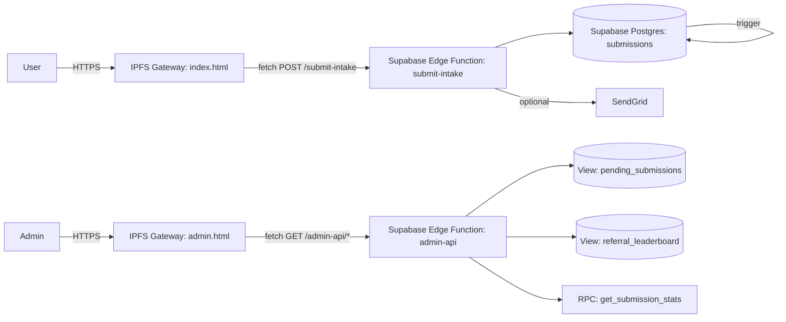
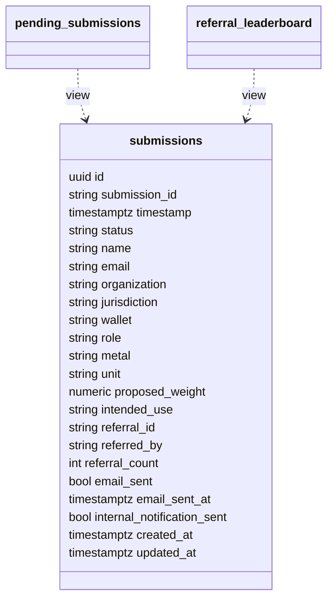

# Architecture

## System boundary

This repository implements a compliance-safe intake and observation system:

- Public users can submit non-binding, weight-referenced allocation intent.
- Operators can observe submissions via a read-only admin panel.
- No irreversible actions (no approvals, no minting, no promises) occur in this system.

## Components

- IPFS-hosted frontend: public intake form + referral success page
- IPFS-hosted admin UI: read-only operations dashboard
- Supabase Postgres: durable storage + triggers + views
- Supabase Edge Functions: public intake API + protected admin API
- SendGrid: outbound receipts and internal notifications (optional)

## High-level flow

## Data model (core)

## Trust boundaries

- Public traffic: IPFS gateway + public Edge Function endpoint
- Privileged traffic: admin Edge Function endpoint protected by `ADMIN_TOKEN`
- Database writes: only Edge Function uses service role key (server-side only)
- Database reads (admin): served via Edge Function (server-side only)
