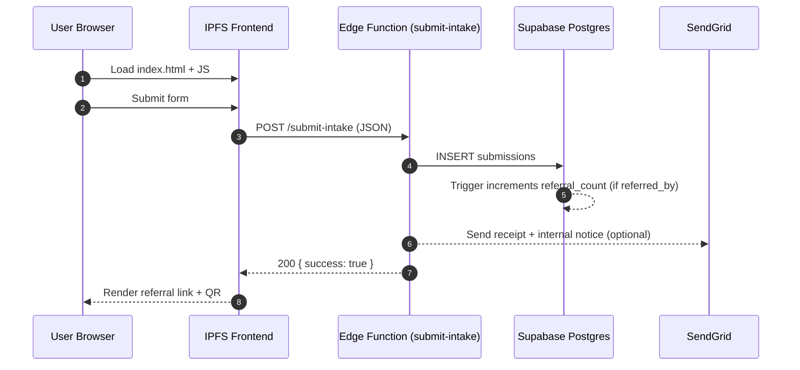
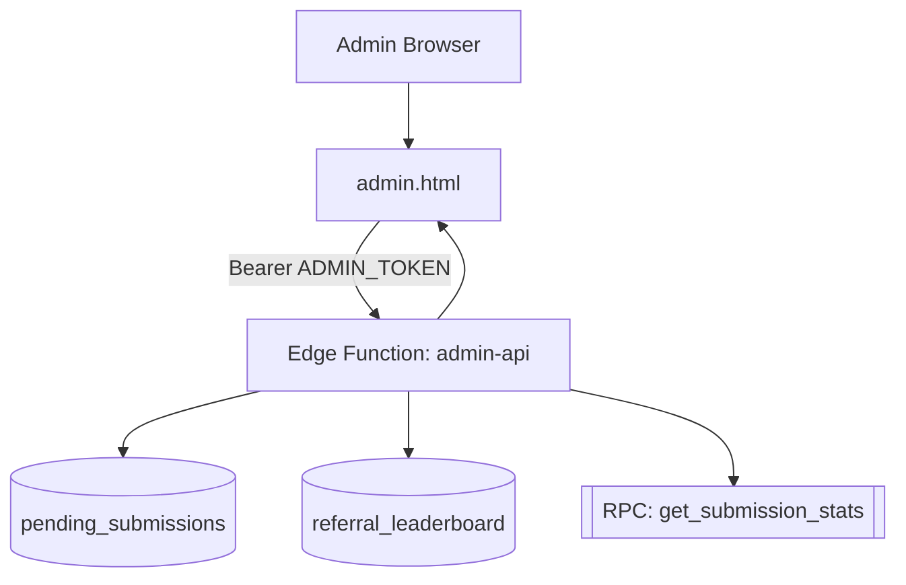
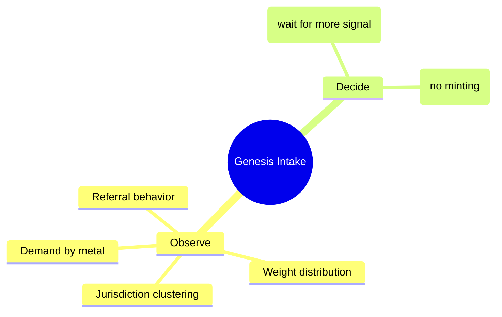
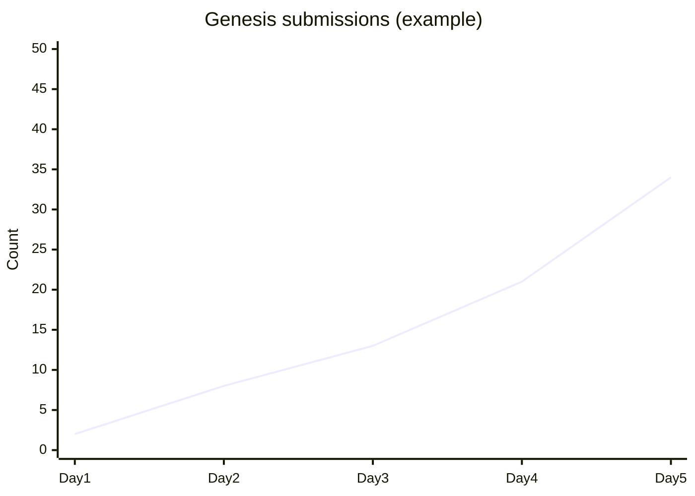

# Flows (Diagrams)

## Intake submission sequence

## Admin read-only flow

## Flow tree (decision boundary)

## Example metrics graph (template)

This is a template for operational dashboards. Replace values with real observed data.

